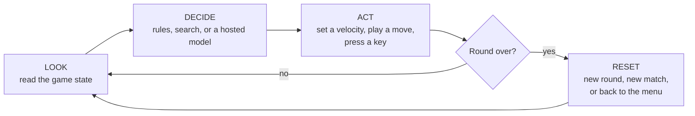
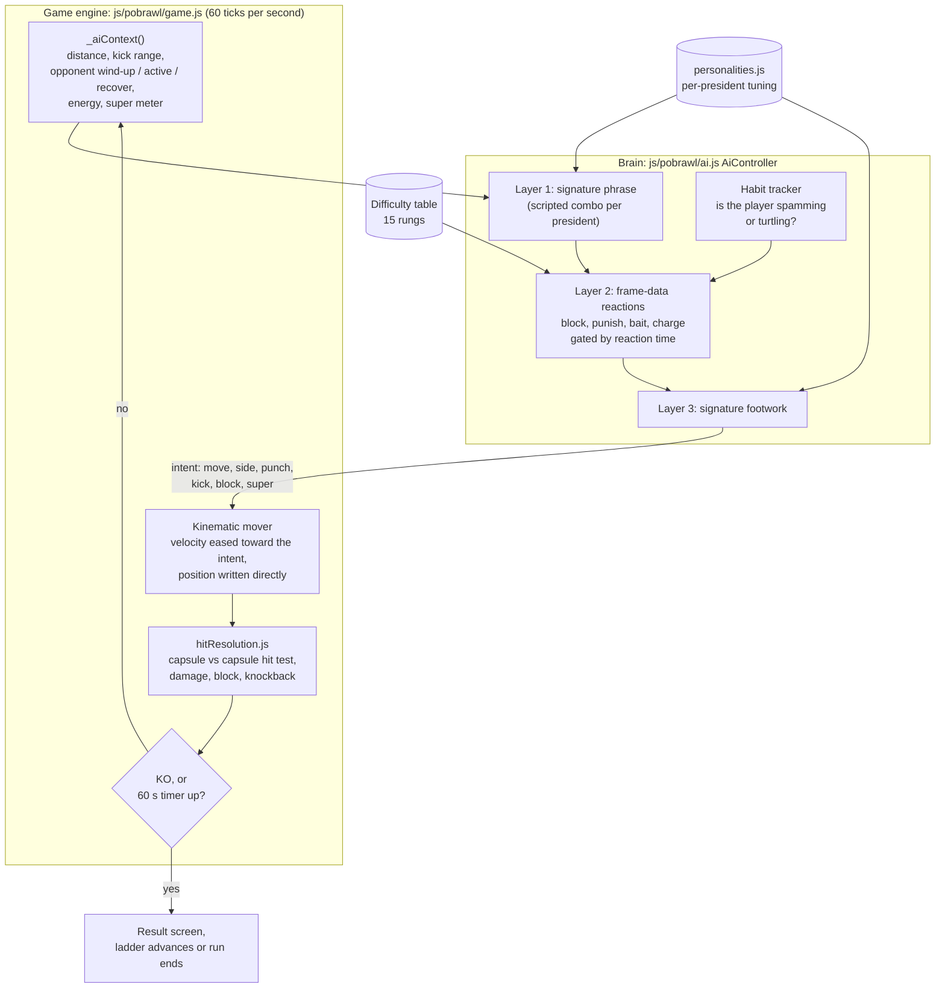
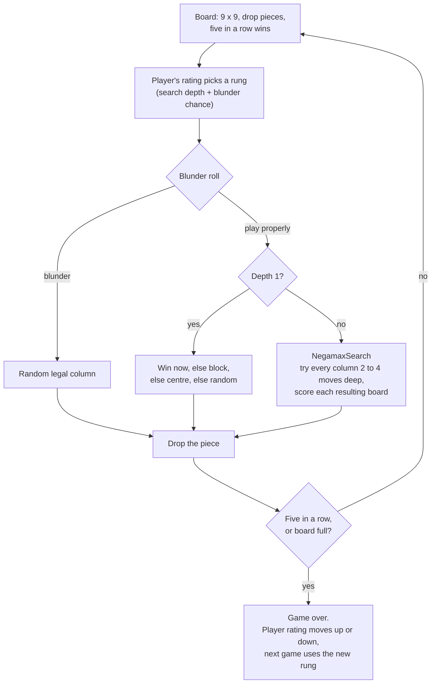
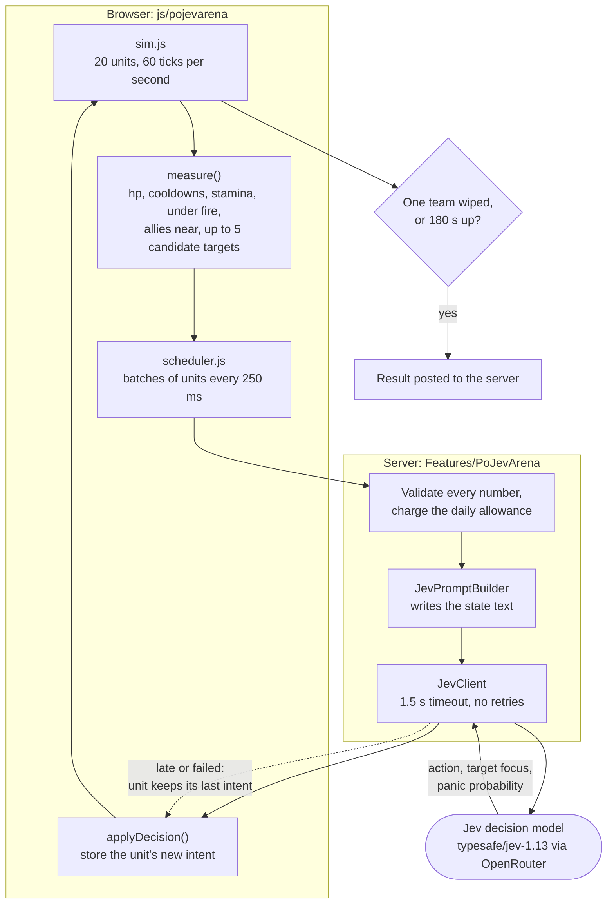
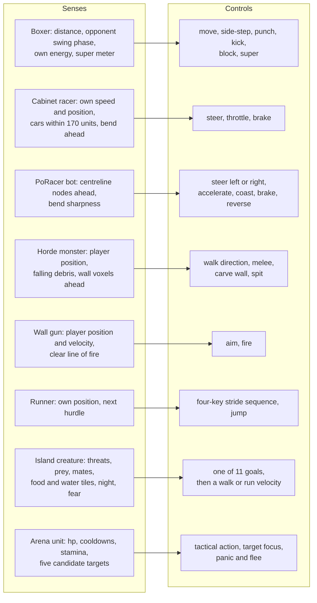
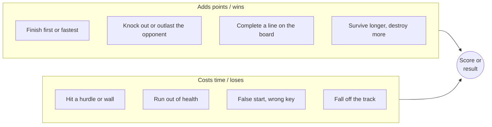
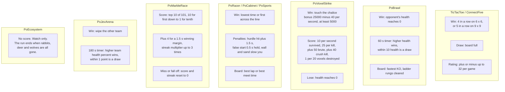
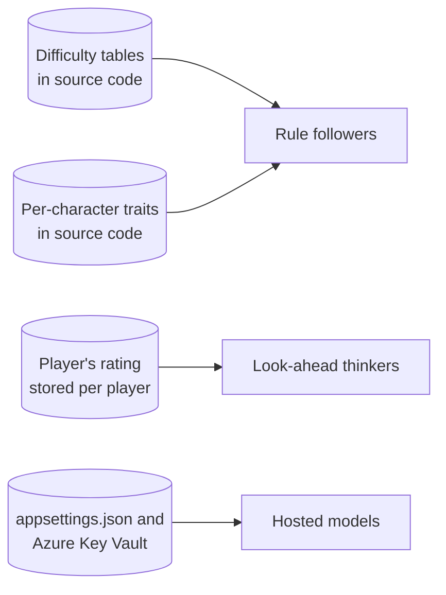
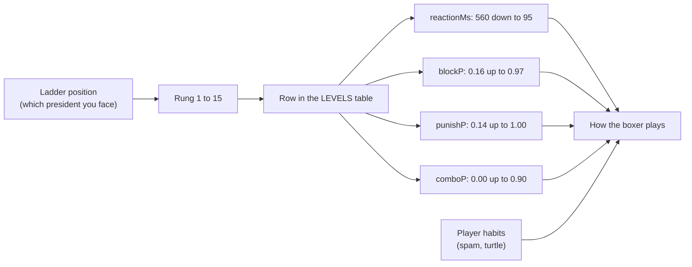

# Core Architecture & Game Loop

Snapshot date: 2026-10-03. Part of the `DOCS/20261003` set:
[model_summary.md](model_summary.md) · [training_metrics_guide.md](training_metrics_guide.md) ·
[creatures_dashboard.html](creatures_dashboard.html) · [scene_layout.html](scene_layout.html) ·
[creature_benchmarks.html](creature_benchmarks.html)

> **Read this first.** This doc set follows a template written for Unity ML-Agents projects.
> PoMiniGames is not a Unity project and contains **no trained models**: no ONNX files, no
> training runs, no reward curves. Every computer-controlled character here is either
> hand-written rules running in the browser or on the .NET server, or a hosted language model
> called over the network. Where the template asks for a training-only fact, the docs say
> "not applicable" instead of inventing a number. A "Unity equivalent" column is included so
> readers from that world can map the ideas across.

---

## Tier 1: Quick Look (30 seconds)

PoMiniGames is a website with fourteen small games. Twelve of them contain something that
plays without a human: a board-game opponent, a boxer, a racing driver, a horde monster, a
wolf on an island. None of them learned their behaviour. Designers wrote the rules and tuned
the numbers by hand.

There are three kinds of computer player:

| Kind | What it is | Where it runs | Examples |
|---|---|---|---|
| **Rule followers** | Fixed rules plus dice rolls. Difficulty is a table of numbers. | Player's browser | PoBrawl boxers, PoVoxelStrike monsters, PoSports runners |
| **Look-ahead thinkers** | Try every move a few turns ahead and pick the best. | Player's browser | TicTacToe and ConnectFive opponents |
| **Hosted models** | A language or decision model answers a question over the internet. | Cloud service, called by the server | Jev (battle tactics), the joke judge, quiz writer, island chronicler |

Every one of them runs the same loop many times a second: **look, decide, act, check if the
round is over**.

What to know as a designer or producer:

- Changing how hard an opponent is means editing a row in a table, not retraining anything.
- Only the hosted models cost money per decision. Each has a daily cap and a scripted fallback.
- The only stored performance data in the repo is five recorded PoCabinet laps used by tests.

---

## Tier 2: Core Mechanics

### 2.1 The Decision Loop

**High-level view.** Every agent in the project fits this shape.



**Component-level view: a rule follower (PoBrawl boxer).** The engine asks each fighter's
controller for an "intent" 60 times a second. The controller never touches physics itself.



**Component-level view: a look-ahead thinker (ConnectFive opponent).**



**Component-level view: a hosted model (Jev in PoJevArena).** The browser simulates the
fight; the model only answers "what should this unit do next?" once per unit per second.



**Engine mapping.**

| Concept | In PoMiniGames | Unity equivalent |
|---|---|---|
| The agent | A JS class (`AiController`, `AiTypist`, `Enemies`) or C# class (`TicTacToeAI`, `PoRacerAiDriver`) | `Agent` MonoBehaviour |
| Sensors | A plain object built each tick from game state (`_aiContext`, `perceive`, `measure`) | `RayPerceptionSensor`, `CollectObservations` |
| Brain / policy | Hand-written rules, a search, or a web call | `.onnx` model in Behavior Parameters |
| Actions | An "intent" object, a board move, or a key press | `OnActionReceived` |
| Physics | cannon-es (PoBrawl ragdolls, PoVoxelStrike player, PoMarbleRace) or custom arcade maths | Rigidbody, ConfigurableJoint |
| Episode reset | Round / match / race restart; demo modes loop on their own | `EndEpisode()` |
| Decision period | The tick rate plus any reaction-time gate | Decision Requester |

### 2.2 Controls & Movement Map

**High-level view.**

```mermaid
flowchart LR
    subgraph Senses["What agents sense"]
        P["Positions and distances"]
        V["Own speed and heading"]
        O["Obstacles, walls, track shape"]
        T["Opponent's current move<br/>and timing"]
        N["Needs: hunger, thirst,<br/>stamina, health"]
    end
    subgraph Controls["What agents control"]
        M["Move direction and speed"]
        ST["Steer, throttle, brake"]
        AT["Attack, block, special"]
        J["Jump"]
        BM["Board move"]
        K["Key presses"]
    end
    Senses --> BR(("Brain")) --> Controls
```



**Component-level view.** Each row is one agent family.



How movement reaches the engine:

| Agent | Movement type | What that means |
|---|---|---|
| PoBrawl boxer | Kinematic | Velocity is eased toward the intent and the position is written directly. Physics only takes over for the KO ragdoll. |
| PoVoxelStrike monsters | Direct position | No physics body. The mesh is moved each frame and settles onto the terrain height. |
| PoCabinet racer | Custom arcade car | Speed along the heading; turning limited by grip. |
| PoRacer bot | Custom arcade car | One circle per car; on-or-off steering and pedals. |
| PoSports runner | Scalar lane state | Each finished key sequence adds a speed impulse; speed decays between strides. |
| PoMarbleRace marble | Physics body | A rolling sphere. No brain: gravity and the track do everything. |
| PoEcosystem creature | Kinematic over a heightmap | Velocity intent with fallback headings when blocked. |
| PoJevArena unit | Force-based 2D | Leg force limited by grip and stamina. |

### 2.3 Goals & Scoring Rules

**High-level view.** Nothing is "rewarded" in the training sense. These are the game's own
win, lose and score rules, which are what a trained agent would have been scored on.



**Component-level view.**



### 2.4 Tuning Settings

**High-level view: where the knobs live.**



**Component-level view: one knob traced end to end (PoBrawl difficulty).**



**The configuration table.** The left column uses the plain-language names from the training
world. The middle column is the closest real setting in this project.

| Plain-language setting | Training-world name | Closest equivalent here | Value(s) | Where |
|---|---|---|---|---|
| **Learning pace** | Learning rate | Nothing trains. Closest: how fast the board-game CPU's strength follows the player's rating. | `AdaptiveK = 32` | `Client/Services/Play/GameStatsService.cs` |
| **Learning pace (generations)** | Mutation rate | How much a newborn island creature's personality differs from its parents. | `TRAIT_MUTATION_SIGMA = 0.08` | `js/poecosystem/sim/core/config.js` |
| **How far ahead it plans** | Time horizon | Moves searched ahead on the board. | 4 (TicTacToe hard), 1 to 4 (ConnectFive by rating) | `TicTacToeAI.cs`, `ConnectFiveAI.cs` |
| | | Distance a racer looks down the road. | 25 to 130 units per official (PoCabinet); 9 to 24 track segments (PoRacer) | `js/pocabinet/physics.js`, `PoRacerSim.cs` |
| | | How early a runner spots a hurdle. | 1.6 / 1.8 / 2.0 m (easy / medium / hard) | `js/posports/ai.js` |
| **Memory size** | Buffer / memory size | Positions the board search remembers. | 2048 (ConnectFive) | `NegamaxSearch.cs` |
| | | How long an island creature remembers food and water. | 120 s food, 240 s water | `js/poecosystem/sim/core/config.js` |
| | | How long a boxer remembers the player's habits. | `HABIT_TAU = 8` s | `js/pobrawl/ai.js` |
| **Exploration rate** | Epsilon / entropy | Chance the board CPU plays a random move on purpose. | 0.55 down to 0.05 (TicTacToe); 0.60 down to 0.00 (ConnectFive) | `StrengthForElo` in each AI file |
| | | Chance a PoCabinet racer misjudges a corner. | `wildness` 0.01 to 0.12 for the four officials | `js/pocabinet/physics.js` |
| | | Steering wobble on a PoRacer bot. | `0.015 x (1.15 - CorneringSkill)` per tick | `PoRacerSim.cs` |
| | | Typing mistakes by a PoSports runner. | `errorRate` 0.008 to 0.01 | `js/posports/ai.js` |
| **Reaction time** | Decision period | Delay before a boxer makes a weighted choice. | 560 ms (rung 1) down to 95 ms (rung 15) | `js/pobrawl/ai.js` |
| **How often it thinks** | Decision frequency | Ticks per second. | PoBrawl 60, PoSports 60, PoJevArena sim 60 (one model call per unit per second), PoRacer 50, PoCabinet 30, PoEcosystem 20 (goals re-scored 4 times a second) | each engine's constants |
| **Batch size** | Batch size | Units sent to Jev per request. | `MaxBatch = 8` | `PoJevArenaEndpoints.cs` |
| **Aggression** | Reward weight | Boxer's attack appetite. | `aggro` 0.72 to 1.50 | `js/pobrawl/ai.js` |
| | | PoRacer bot's risk on corners. | `Aggression` 0.30 to 0.95; tier `botCaution` 0.58 / 0.42 / 0.20 | `PoRacerAiDriver.cs`, `PoRacerRaceRegistry.cs` |
| **Spending cap** | Compute budget | Hosted-model tokens per player per day. | `DailyTokensPerIdentity = 250000` | `appsettings.json` |
| | | Jev decisions per player per day. | `DailyCallsPerIdentity = 20000` | `appsettings.json` |
| **Give-up time** | Timeout | Longest a hosted-model call may take. | 20 s total (chat models), 1.5 s (Jev) | `AzureOpenAIResilience.cs`, `JevOptions.cs` |

---

## Tier 3: Setup Guide

### 3.1 Run it

```powershell
docker compose up -d azurite
dotnet run --project src/PoMiniGames.API/PoMiniGames.API.csproj
# open http://localhost:5080
```

Every game has a demo mode where the computer plays both sides. That is the quickest way to
watch an agent without touching anything.

### 3.2 Change how hard an opponent is

There is no inspector panel. Settings are constants in source files; edit, rebuild, reload.

| To change | Edit | Notes |
|---|---|---|
| PoBrawl difficulty curve | `LEVELS` in `wwwroot/js/pobrawl/ai.js` | One row per rung. `reactionMs` lower is harder; the `P` values are chances from 0 to 1. |
| A president's fighting style | that president's block in `wwwroot/js/pobrawl/personalities.js` | `footwork`, three `aiPatterns`, and a `super`. The schema is documented at the top of the file. |
| A president's body | `wwwroot/js/pobrawl/fighters.js` | `heightScale`, `buildScale`, `mass`, `attackPower`, `moveAccel`. |
| Board-game CPU strength | `StrengthForElo` in `TicTacToeAI.cs` / `ConnectFiveAI.cs` | Rating thresholds map to search depth and blunder chance. |
| Horde monsters | `ARCHETYPES` in `wwwroot/js/povoxelstrike/enemies.js` | `hp`, `speed`, `meleeDamage`, `spitInterval`. Spawn pacing is in the spawn director below it. |
| Wall guns | constants at the top of `FortressGuns` in `wwwroot/js/povoxelstrike/fortress.js` | Range 120, reload 2.2 s, spread 0.035 rad. |
| PoSports CPU runners | `DIFFICULTIES` in `wwwroot/js/posports/ai.js` | The medium row is mirrored in `PoSportsConstants.cs` and pinned by a test; change both. |
| PoCabinet officials | the roster in `wwwroot/js/pocabinet/physics.js` **and** `PoCabinetSim.cs` | The two files are a line-for-line mirror. Change both or the lap verifier will reject laps. |
| PoRacer bots | `PoRacerAiDriver.cs` (personalities), `PoRacerRaceRegistry.cs` (tier pace and caution) | Server-side only. |
| Island creatures | `wwwroot/js/poecosystem/sim/creatures/species.js` and `sim/core/config.js` | PoEcosystem is watch-only by design; tune numbers, do not add player controls. |
| Arena creatures | `Shared/Games/PoJevArenaShared.cs` | Presets, ability costs, build budget of 80. |

### 3.3 Joint limits

Only two games have jointed bodies, and in both the joints are for falling over, not for
walking.

| Rig | Parts | Joints | Limits (cone / twist, radians) |
|---|---|---|---|
| PoBrawl KO ragdoll (`ragdollPhysics.js`) | 11 boxes | 10 cone-twist | waist 0.50 / 0.40 · neck 0.80 / 0.80 · shoulders 1.20 / 0.50 · elbows 0.90 / 0.30 · hips 1.00 / 0.40 · knees 0.90 / 0.25 |
| PoEcosystem biped ragdoll (`sim/physics/ragdoll.js`) | 7 boxes | 6 cone-twist | not listed here; see the file |
| PoEcosystem quadruped ragdoll | 6 boxes | 5 cone-twist | not listed here; see the file |

Everything else is a single body with no joints: a sphere (marbles, the PoVoxelStrike
player), a circle (PoRacer cars, arena units), a capsule (PoCabinet cars), or no physics
body at all (horde monsters, runners, living island creatures).

### 3.4 Hosted-model settings

Settings live under `PoMiniGames:AI` and `PoMiniGames:Jev` in `appsettings.json`, with
secrets in Azure Key Vault. Do not use `dotnet user-secrets` in this repo.

| Setting | Meaning |
|---|---|
| `PoMiniGames:AI:FoundryEndpoint` | Where the chat models live (Key Vault secret). |
| `PoMiniGames:AI:DefaultDeployment` | Model used when a game has no specific entry. |
| `PoMiniGames:AI:Deployments` | Map of `game` or `game.task` to a model name, for example `pocabinet.banter`. |
| `PoMiniGames:AI:DailyTokensPerIdentity` | Per-player daily spend cap. 0 turns it off. |
| `PoMiniGames:Jev:Model` | Pinned to `typesafe/jev-1.13`. |
| `PoMiniGames:Jev:CallTimeoutMs` | 1500. A late answer is dropped and the unit keeps its last order. |
| `<Game>:Features:UseMockAI` | Use canned answers instead of a real model. Honoured only outside production. Tests force it on. |

### 3.5 Known gaps worth fixing before relying on these docs

Found while reading the code for this snapshot:

- **No strength tests exist** for either board-game opponent.
- ConnectFive declares an 8-second thinking budget (`AiMoveBudgetMs`) that nothing enforces.
- PoVoxelStrike monsters and PoRacer steering wobble use unseeded randomness, so their runs
  cannot be replayed exactly.
- PoBrawl demo mode can pair in BOB, whom the server's rating endpoint rejects.
- PoSports "hard" has a slightly higher typing error rate (0.01) than "medium" (0.008).
